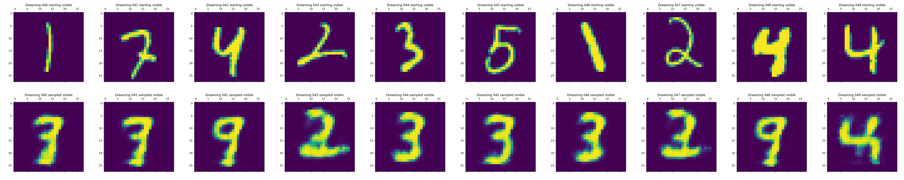
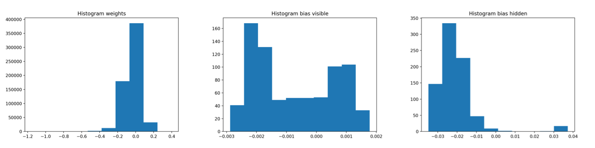

# RBMs revisited in TensorFlow 2

This repo. contains an implementation of RBMs in `TensorFlow 2`, (specifically: `2.3`).

Dreaming digits:
- Top row = original training data.
- Bottom row = dreamed digits after CD sampling.


Histogram of weights and biases:


## Usage

```
python rbm_mnist.py
```
You will be prompted for more arguments.

## Tests

Tests for various components are:
```
python test_gibbs.py
python test_loss.py
python test_rbm.py
```

## Source

The implementation of the RBM (and the Gibbs sampler) is in the `rbm` folder.
